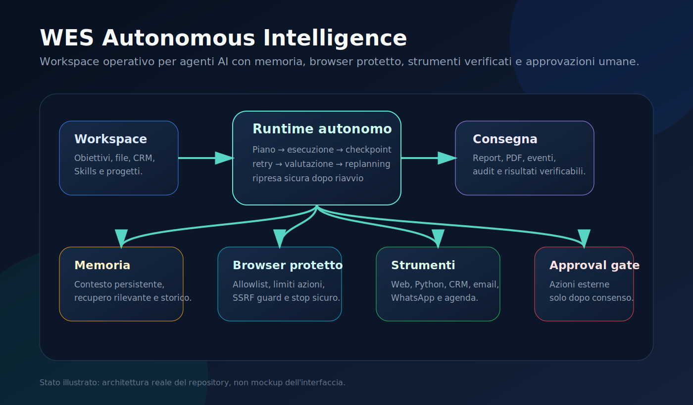
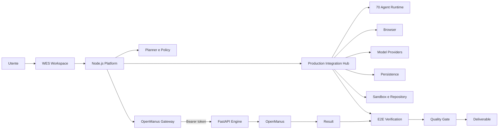

# WES Autonomous Intelligence

<p align="center">
  
</p>

<p align="center">
  <strong>Piattaforma operativa per agenti AI con orchestrazione Node.js, motore OpenManus, runtime multi-agente, memoria, browser protetto, sandbox e controlli fail-closed.</strong>
</p>

<p align="center">
  <a href="https://github.com/walterzannoni90-netizen/piattaformaipersonale/actions/workflows/ci.yml"></a>
  
  
  
</p>

WES riceve un obiettivo, costruisce un piano eseguibile, seleziona strumenti autorizzati, salva checkpoint, recupera esecuzioni interrotte e verifica il risultato prima della consegna. La piattaforma Node.js gestisce utenti, workspace, policy, memoria, audit e approvazioni; il servizio Python OpenManus esegue i task autonomi più complessi tramite API interna autenticata.

## Stato verificato

Il repository include e testa:

- planner deterministico e planner AI;
- executor resiliente con retry, timeout, checkpoint, cancellazione e recovery;
- runtime multi-agente obbligatorio con 70 agenti e verifica su 1.000 casi;
- memoria operativa, memoria per progetto e checkpoint persistenti;
- valutazione del risultato, replanning e supervisione del recovery;
- browser protetto da allowlist, policy, budget di azioni e approvazione del payload esatto;
- sandbox per processi e operazioni controllate sul repository;
- client e gateway OpenManus con autenticazione, polling, canary, circuit breaker, fallback e idempotenza;
- servizio FastAPI OpenManus con SQLite, WAL, cancellazione reale e recovery dopo riavvio;
- hub di integrazione di produzione che richiede sei aree operative prima di eseguire un task;
- telemetria del ciclo di vita e verifica end-to-end obbligatoria;
- CI per sintassi, test Node.js, dipendenze Python e build Docker.

> Un test verde dimostra il comportamento coperto dal test. Non dimostra, da solo, superiorità assoluta rispetto a prodotti esterni né sostituisce una validazione con infrastruttura e credenziali reali.

## Sei integrazioni di produzione

`ProductionIntegrationHub` applica una politica fail-closed: l'esecuzione non parte finché tutte le aree richieste non risultano pronte.

| Area | Contratto minimo | Scopo |
|---|---|---|
| `agents` | `execute`, `health` | esecuzione multi-agente |
| `browser` | `execute`, `health` | sessioni browser reali |
| `models` | `complete`, `embed`, `health` | modelli generativi ed embedding |
| `persistence` | `load`, `save`, `health` | checkpoint e stato durevole |
| `sandboxRepository` | `execute`, `read`, `write`, `test`, `health` | codice, file, repository e test |
| `endToEnd` | `run`, `health` | verifica finale del risultato |

Il flusso:

1. valida i contratti dei servizi;
2. esegue gli health check in parallelo;
3. blocca il task se una sola area non è pronta;
4. carica il checkpoint;
5. inietta browser, modelli, persistenza e sandbox nel contesto degli agenti;
6. salva risultato o errore;
7. richiede una verifica end-to-end positiva;
8. emette telemetria di avvio, completamento o fallimento.

## Architettura



## Componenti principali

| Componente | Responsabilità |
|---|---|
| `productionIntegrationHub` | readiness fail-closed delle sei integrazioni e verifica finale |
| `unifiedTaskRuntime` | selezione prioritaria del runtime di produzione e compatibilità con i runtime precedenti |
| `mandatorySeventyAgents` | coordinamento obbligatorio dei 70 agenti |
| `productionAutonomyRuntime` | esecuzione autonoma con strumenti, memoria e supervisione |
| `resilientExecutor` | retry, timeout, checkpoint, cancellazione e replanning |
| `runtimePersistenceAdapter` | persistenza di stato, eventi, errori e completamento |
| `browserRuntime` | sessioni browser autorizzate e tracciate |
| `productionCapabilitySuite` | memoria semantica, sandbox, plugin, osservabilità e ottimizzazione |
| `openManusGateway` | rollout, canary, circuit breaker, fallback, idempotenza e metriche |
| `openManusClient` | comunicazione autenticata Node.js/Python |
| `services/openmanus/app.py` | API FastAPI, persistenza e cancellazione reale |

## Requisiti

- Node.js 22+
- Python 3.12+
- Docker e Docker Compose consigliati
- credenziali reali per i provider e i connettori usati in produzione

## Avvio locale

```bash
cp .env.example .env
npm ci
python3 -m venv .venv
. .venv/bin/activate
pip install -r requirements.txt
npm run build
npm test
npm start
```

## Avvio con OpenManus

```bash
export OPENMANUS_SERVICE_TOKEN="$(openssl rand -hex 32)"
docker compose -f docker-compose.openmanus.yml up --build
```

## Configurazione essenziale

| Variabile | Uso |
|---|---|
| `OPENMANUS_ENGINE_URL` | URL interno del servizio FastAPI |
| `OPENMANUS_SERVICE_TOKEN` | autenticazione Node.js/Python; obbligatoria in produzione |
| `OPENMANUS_REQUEST_TIMEOUT_MS` | timeout delle chiamate HTTP |
| `OPENMANUS_STATE_DB` | database persistente del motore |
| `OPENMANUS_RUNTIME_MODE` | `disabled`, `shadow`, `canary` o `primary` |
| `OPENMANUS_CANARY_PERCENT` | percentuale deterministica di task delegati |
| `APP_URL` | URL HTTPS canonico |
| `JWT_SECRET` | firma delle sessioni |
| `APP_ENCRYPTION_KEY` | cifratura dei segreti |
| `OPENROUTER_API_KEY` | modelli AI |
| `TAVILY_API_KEY` | ricerca web verificabile |

## Test e verifica

Eseguire la sequenza completa:

```bash
npm ci
npm run check
npm test
npm run build
npm audit --omit=dev
```

Controlli specifici del runtime di produzione:

```bash
node --test --test-concurrency=1 test/productionIntegrationHub.test.js
node scripts/run-runtime-benchmarks.js
```

I test dell'hub verificano:

- presenza di tutte e sei le aree;
- rifiuto dei contratti incompleti;
- health check positivo e gestione delle eccezioni;
- blocco fail-closed di integrazioni non pronte;
- caricamento checkpoint e iniezione dei servizi;
- persistenza del successo e degli errori;
- fallimento quando la verifica E2E non passa;
- telemetria di successo e fallimento;
- priorità dell'hub nel runtime unificato.

## Cosa significa “completo”

### Completato nel repository

- architettura e contratti delle sei integrazioni;
- runtime fail-closed;
- test automatici e controlli di sintassi;
- persistenza, recovery, telemetria e quality gate;
- documentazione tecnica e procedure di verifica.

### Da validare nell'ambiente reale

- credenziali dei provider AI;
- browser driver e sessioni persistenti;
- database e storage di produzione;
- sandbox isolata e permessi repository;
- endpoint, rete, segreti e osservabilità del deployment;
- test E2E con servizi reali e carico rappresentativo.

Il codice non considera un servizio “attivo” soltanto perché esiste un adapter: ogni integrazione deve superare il proprio health check.

## Sicurezza operativa

- cookie `HttpOnly`, `SameSite=Lax` e `Secure` in produzione;
- JWT con rilettura dell'account dal database;
- segreti cifrati AES-256-GCM;
- fetch web protetto da SSRF, redirect e DNS rebinding;
- browser limitato da allowlist e budget di azioni;
- azioni esterne subordinate ad approvazione esatta;
- token OpenManus obbligatorio in produzione;
- gateway disattivato per default e attivabile solo esplicitamente;
- circuit breaker e fallback solo per guasti recuperabili;
- persistenza SQLite con WAL per il motore locale;
- cancellazione reale tramite `asyncio.Task.cancel()`;
- nessun completamento simulato dopo un riavvio.

## Limiti dichiarati

- SQLite locale richiede una singola istanza per database; un deployment distribuito richiede persistenza condivisa;
- connettori e provider funzionano solo con configurazione e credenziali valide;
- i test con mock verificano i contratti, non la disponibilità dei servizi esterni;
- benchmark comparativi con altri prodotti devono essere riproducibili, equivalenti e misurati su infrastruttura reale;
- il concept grafico nei documenti è una specifica visiva, non uno screenshot della produzione.

## Segnalazioni di sicurezza

Usa una [GitHub private security advisory](https://github.com/walterzannoni90-netizen/piattaformaipersonale/security/advisories/new). Non pubblicare segreti o vulnerabilità sfruttabili in issue pubbliche.

## Licenza

MIT.
