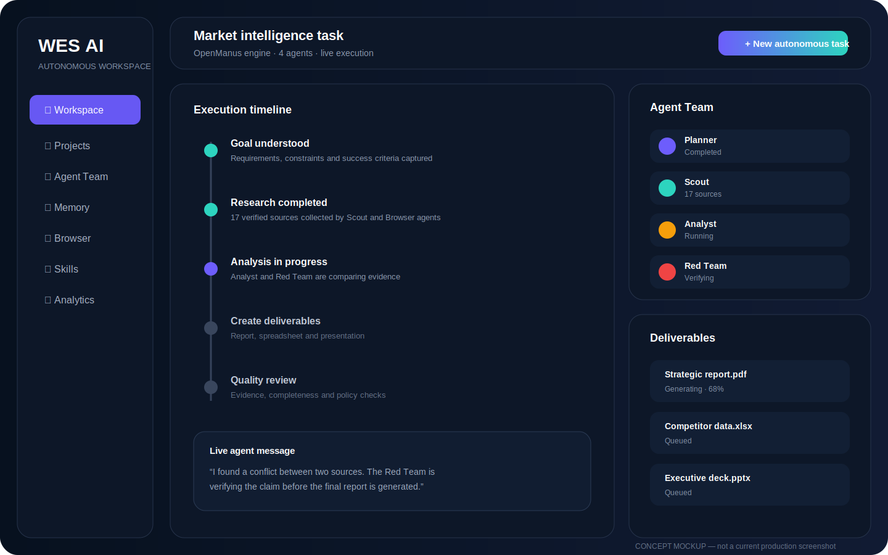
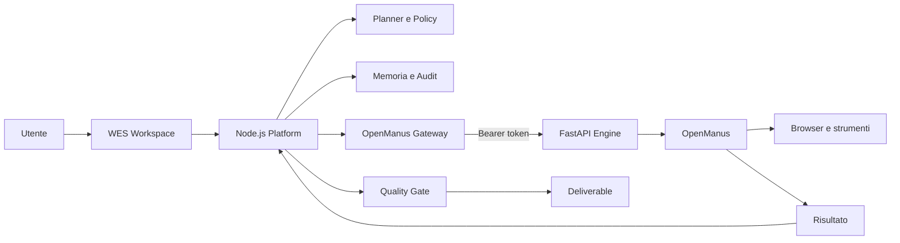

# WES Autonomous Intelligence

<p align="center">
  
</p>

<p align="center">
  <strong>Piattaforma operativa per agenti AI con orchestrazione Node.js, motore autonomo OpenManus, memoria, browser protetto e approvazioni umane.</strong>
</p>

<p align="center">
  <a href="https://github.com/walterzannoni90-netizen/piattaformaipersonale/actions/workflows/ci.yml"></a>
  
  
  
  
</p>

WES riceve un obiettivo, costruisce un piano eseguibile, seleziona strumenti autorizzati, salva checkpoint e consegna risultati verificabili. L'architettura ibrida mantiene nella piattaforma Node.js utenti, workspace, memoria, audit e controlli; il servizio Python OpenManus esegue i task autonomi più complessi attraverso un'API interna autenticata.

## Stato verificato

La base attuale comprende:

- planner deterministico e piani generati con AI;
- executor con retry, checkpoint e recovery;
- memoria operativa e memoria per progetto;
- valutazione del risultato e replanning;
- browser protetto da allowlist e limiti d'azione;
- Agent Team con specialisti, quorum e Red Team;
- CRM, email, WhatsApp, agenda e automazioni;
- approvazione del payload esatto prima di azioni esterne;
- client Node.js per OpenManus con autenticazione, timeout, polling e cancellazione;
- servizio FastAPI OpenManus con stato persistente SQLite, cancellazione reale dei task e recovery esplicito dopo riavvio;
- gateway Node.js resiliente con rollout disattivato, shadow, canary o primary, circuit breaker, fallback selettivo, idempotenza, health cache, progress normalizzato e metriche;
- Docker Compose dedicato all'architettura ibrida.

> Il concept grafico sotto rappresenta la direzione del prodotto finale e non uno screenshot della versione oggi in produzione.

<p align="center">
  
</p>

## Architettura ibrida



### Confine delle responsabilità

| Livello | Responsabilità |
|---|---|
| WES Node.js | utenti, autorizzazioni, pagamenti, workspace, memoria, audit, approvazioni e consegna |
| OpenManus gateway | rollout, canary, circuit breaker, idempotenza, fallback, metriche e normalizzazione stato |
| OpenManus client | autenticazione interna, timeout, polling, cancellazione e normalizzazione errori HTTP |
| OpenManus FastAPI | ciclo di vita dei task, persistenza, recovery e gestione dell'agente Python |
| OpenManus | pianificazione ed esecuzione autonoma tramite strumenti e browser |

## Componenti principali

| Componente | Responsabilità |
|---|---|
| `agentOrchestrator` | ingresso dei task e strumenti applicativi controllati |
| `unifiedTaskRuntime` | ponte dai piani persistiti al runtime resiliente |
| `autonomyRuntime` | memoria, valutazione, browser e auto-correzione |
| `resilientExecutor` | checkpoint, retry, cancellazione e replanning |
| `openManusGateway` | rollout controllato e protezione del confine Node/Python |
| `openManusClient` | comunicazione sicura tra Node.js e il motore Python |
| `services/openmanus/app.py` | API del motore, persistenza e cancellazione reale |
| `agentTeam` | specialisti paralleli, quorum e consolidamento evidenze |
| `toolRegistry` | autorizzazione per ruolo, piano e rischio |

## Sicurezza operativa

- cookie `HttpOnly`, `SameSite=Lax` e `Secure` in produzione;
- JWT con rilettura dell'account dal database;
- segreti cifrati AES-256-GCM;
- fetch web protetto da SSRF, redirect e DNS rebinding;
- browser limitato da allowlist e budget di azioni;
- azioni esterne subordinate ad approvazione esatta;
- token obbligatorio per il servizio OpenManus in produzione;
- gateway OpenManus disattivato per default e attivabile soltanto tramite configurazione esplicita;
- circuit breaker dopo errori consecutivi e fallback soltanto per guasti infrastrutturali recuperabili;
- task OpenManus persistiti su SQLite con WAL;
- task interrotti realmente tramite `asyncio.Task.cancel()`;
- task rimasti in esecuzione durante un riavvio marcati esplicitamente come falliti, senza fingere un completamento.

## Requisiti

- Node.js 22+
- Python 3.12+
- Docker e Docker Compose consigliati
- dipendenze Python definite in `requirements.txt` e `services/openmanus/requirements-api.txt`

## Avvio locale della piattaforma

```bash
cp .env.example .env
npm ci
python3 -m venv .venv
. .venv/bin/activate
pip install -r requirements.txt
npm run build
npm test
npm start
```

## Avvio con OpenManus

```bash
export OPENMANUS_SERVICE_TOKEN="$(openssl rand -hex 32)"
docker compose -f docker-compose.openmanus.yml up --build
```

Configurazione essenziale:

| Variabile | Uso |
|---|---|
| `OPENMANUS_ENGINE_URL` | URL interno del servizio FastAPI |
| `OPENMANUS_SERVICE_TOKEN` | autenticazione tra Node.js e Python; obbligatoria in produzione |
| `OPENMANUS_REQUEST_TIMEOUT_MS` | timeout delle singole chiamate HTTP |
| `OPENMANUS_STATE_DB` | database persistente dei task del motore |
| `OPENMANUS_RUNTIME_MODE` | `disabled`, `shadow`, `canary` o `primary` |
| `OPENMANUS_CANARY_PERCENT` | percentuale deterministica di task autonomi delegati |
| `OPENMANUS_CIRCUIT_FAILURES` | errori consecutivi prima dell'apertura del circuito |
| `OPENMANUS_CIRCUIT_RESET_MS` | tempo di raffreddamento del circuito |
| `OPENMANUS_HEALTH_TTL_MS` | durata della cache di health check |
| `APP_URL` | URL HTTPS canonico della piattaforma |
| `JWT_SECRET` | firma delle sessioni |
| `APP_ENCRYPTION_KEY` | cifratura dei segreti |
| `OPENROUTER_API_KEY` | planner e specialisti AI |
| `TAVILY_API_KEY` | ricerca web verificabile |

## Test e qualità

```bash
npm run check
npm test
npm run build
npm audit --omit=dev
```

La CI valida sintassi, test Node, dipendenze Python e build Docker. I test coprono planner, runtime resiliente, recovery, memoria, browser, policy, sicurezza web, client OpenManus e gateway di rollout.

## API OpenManus

| Metodo | Endpoint | Funzione |
|---|---|---|
| `GET` | `/health` | readiness, versione e task attivi |
| `POST` | `/v1/tasks` | crea ed esegue un task |
| `GET` | `/v1/tasks/:id` | legge stato e risultato |
| `POST` | `/v1/tasks/:id/cancel` | richiede e applica la cancellazione |

## Road to v1.0

**Avanzamento macro-roadmap: 1 completato, 17 rimanenti.**

- [x] integrazione infrastrutturale OpenManus: API autenticata, client Node, persistenza, cancellazione e Docker;
- [~] delegazione selettiva: gateway con canary, circuit breaker, fallback, idempotenza e metriche completato; collegamento al ciclo principale ancora da chiudere;
- [ ] orchestratore multi-agente avanzato;
- [ ] memoria semantica persistente;
- [ ] browser autonomo robusto;
- [ ] registry estensibile degli strumenti;
- [ ] recovery distribuito e idempotenza end-to-end;
- [ ] pianificazione dinamica durante l'esecuzione;
- [ ] sandbox isolata per codice;
- [ ] pipeline completa documenti e artefatti;
- [ ] scheduler e condition watch;
- [ ] dashboard live degli agenti;
- [ ] parallelismo e code distribuite;
- [ ] sicurezza enterprise e tenant isolation;
- [ ] marketplace di skill e plugin;
- [ ] benchmark comparativi riproducibili;
- [ ] suite E2E e hardening di produzione;
- [ ] deploy enterprise, osservabilità e release pubblica.

Dettaglio tecnico della fase corrente: [`docs/openmanus-runtime-wave-8.md`](docs/openmanus-runtime-wave-8.md).

## Limiti dichiarati

- il gateway è implementato e testato come componente isolato, ma non ha ancora sostituito il ciclo principale di `agentOrchestrator`;
- l'integrazione infrastrutturale non significa ancora che ogni task dell'interfaccia venga delegato automaticamente a OpenManus;
- SQLite richiede una singola istanza per ciascun database locale;
- i connettori funzionano soltanto quando configurati realmente;
- un test verde conferma il comportamento coperto, non dimostra superiorità assoluta rispetto ad altri prodotti;
- il concept grafico è una specifica visiva del prodotto futuro, non una schermata reale.

## Segnalazioni di sicurezza

Usa una [GitHub private security advisory](https://github.com/walterzannoni90-netizen/piattaformaipersonale/security/advisories/new). Non pubblicare segreti o vulnerabilità sfruttabili in una issue pubblica.

## Licenza

MIT.
