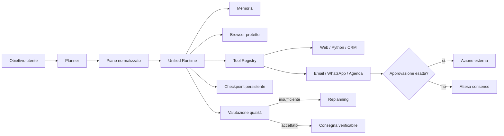

# WES Autonomous Intelligence

<p align="center">
  
</p>

<p align="center">
  <strong>Workspace operativo per agenti AI con memoria, browser protetto, Python ristretto, CRM e approvazioni umane.</strong>
</p>

<p align="center">
  <a href="https://github.com/walterzannoni90-netizen/piattaformaipersonale/actions/workflows/ci.yml"></a>
  
  
  
</p>

WES riceve un obiettivo, costruisce un piano eseguibile, usa soltanto strumenti autorizzati, salva checkpoint dopo ogni transizione e consegna risultati verificabili. Non è una chat che simula azioni: quando una configurazione manca, un tool non è autorizzato o serve consenso umano, il task si ferma in uno stato esplicito.

## Stato del progetto

Il repository contiene oggi una base funzionante e testata per:

- pianificazione deterministica e piani generati con AI;
- executor resiliente con retry controllati e checkpoint;
- recovery dei task dopo riavvio;
- memoria operativa e memoria per progetto;
- valutazione semantica del risultato e replanning correttivo;
- browser autopilot con allowlist, limite di azioni e blocco degli effetti esterni;
- Agent Team con specialisti indipendenti, quorum e Red Team;
- analisi documentale tramite worker Python ristretto;
- CRM, email, WhatsApp, agenda e automazioni;
- approvazione del payload esatto prima di azioni esterne;
- audit degli eventi, file finali Markdown/PDF e consumo tracciato.

### Migrazione runtime

`unifiedTaskRuntime` è il ponte unico tra i piani già persistiti e il nuovo runtime autonomo. Converte i piani legacy nel modello deterministico e delega l’esecuzione a memoria, checkpoint, retry, valutazione e replanning condivisi. Questo elimina progressivamente la necessità di mantenere due loop di esecuzione separati.

## Come funziona



## Componenti principali

| Componente | Responsabilità |
|---|---|
| `agentOrchestrator` | ingresso dei task, strumenti applicativi e compatibilità operativa |
| `unifiedTaskRuntime` | ponte unico dai piani persistiti al runtime resiliente |
| `autonomyRuntime` | memoria, valutazione, browser e auto-correzione |
| `resilientExecutor` | checkpoint, retry, cancellazione e replanning controllato |
| `autonomousPlanner` | stato deterministico del piano e dipendenze tra step |
| `taskStateStore` | persistenza e recovery degli snapshot |
| `browserRuntime` | sessione browser autorizzata e limitata |
| `toolRegistry` | autorizzazione per ruolo, piano e rischio |
| `pythonRunner` | operazioni Python deterministiche senza shell arbitraria |
| `agentTeam` | specialisti paralleli, quorum e consolidamento delle evidenze |

## Sicurezza operativa

- cookie `HttpOnly`, `SameSite=Lax` e `Secure` in produzione;
- JWT con rilettura dell’account dal database;
- origin check e rate limiting sulle mutazioni;
- segreti cifrati AES-256-GCM;
- file privati con controllo proprietario, hash e firma del formato;
- worker Python con rete disabilitata e limiti di risorse;
- fetch web protetto da SSRF, redirect e DNS rebinding;
- browser limitato da allowlist e numero massimo di azioni;
- azioni esterne non ripetute automaticamente quando l’esito è incerto;
- email, WhatsApp, appuntamenti e modifiche CRM subordinati ad approvazione esatta;
- eventi, errori, checkpoint e risultati mantenuti nell’audit trail.

## Requisiti

- Node.js 22+
- Python 3.12+
- dipendenze Python definite in [`requirements.txt`](requirements.txt)

## Avvio locale

```bash
cp .env.example .env
npm ci
python3 -m venv .venv
. .venv/bin/activate
pip install -r requirements.txt
npm run build
npm test
npm start
```

Il server locale è disponibile su `http://localhost:3000`.

Per generare segreti diversi per sessioni e cifratura:

```bash
openssl rand -hex 32
openssl rand -hex 32
```

Per creare il primo amministratore:

```bash
ADMIN_EMAIL=admin@tuodominio.it \
ADMIN_PASSWORD='password-unica-di-almeno-12-caratteri' \
ADMIN_COMPANY='La tua azienda' npm run create-admin
```

## Configurazione essenziale

| Variabile | Uso |
|---|---|
| `APP_URL` | URL HTTPS canonico |
| `JWT_SECRET` | firma delle sessioni |
| `APP_ENCRYPTION_KEY` | cifratura dei segreti |
| `DB_PATH` | database SQLite persistente |
| `AGENT_WORKSPACE_ROOT` | file privati dei task |
| `PYTHON_BIN` | interprete del worker ristretto |
| `OPENROUTER_API_KEY` | planner, composizione e specialisti AI |
| `TAVILY_API_KEY` | ricerca web verificabile |
| `SMTP_*` | invio email e reset password |
| `WHATSAPP_*` | Meta WhatsApp Cloud API |
| `STRIPE_*` | webhook Stripe firmati |

L’applicazione rifiuta l’avvio in produzione quando mancano configurazioni critiche o `APP_URL` non usa HTTPS.

## Test e qualità

```bash
npm run check
npm test
npm run build
npm audit --omit=dev
```

La CI valida sintassi, test Node, dipendenze Python e build Docker. I test coprono planner, runtime resiliente, recovery, memoria, browser, policy, file, sicurezza web e il ponte runtime unificato.

## Docker

```bash
docker build -t wes-autonomous .
docker run --rm -p 3000:10000 --env-file .env \
  -v wes-data:/var/data wes-autonomous
```

Il container usa Node 22, Python in virtualenv, `tini` e un utente non root. Database e workspace devono risiedere su un volume persistente.

## Funzioni applicative

### Workspace autonomo

L’utente crea un task, allega file, sceglie una modalità e osserva piano, eventi, progressione, richieste di approvazione e output finali.

### Agent Team

Da 2 a 6 specialisti lavorano su ruoli distinti. Scout e Strategist possono raccogliere fonti, Analyst e Red Team verificano dati e assunzioni. Le azioni esterne restano sempre nel controllo dell’orchestratore principale.

### WES Skills

Le procedure aziendali diventano playbook versionati e immutabili. Gli snapshot delle versioni vengono associati al task e ricontrollati tramite SHA-256.

### Memoria

La memoria conserva risultati, decisioni e contesto rilevante. Il recupero è limitato e indicizzato per evitare di riempire il prompt con cronologia non pertinente.

### Browser autopilot

Il browser può eseguire soltanto azioni autorizzate, su destinazioni consentite e dentro un budget massimo. Le azioni che producono effetti esterni non vengono eseguite senza consenso.

## API principali

| Metodo | Endpoint | Funzione |
|---|---|---|
| `POST` | `/api/tasks` | crea un task |
| `GET` | `/api/tasks/:id/state` | stato, eventi e output |
| `POST` | `/api/tasks/:id/stop` | interrompe un task |
| `POST` | `/api/tasks/:id/retry` | riprende un task recuperabile |
| `POST` | `/api/projects` | crea un progetto con memoria |
| `POST` | `/api/schedules` | pianifica task ricorrenti |
| `POST` | `/api/skills` | crea una Skill privata |
| `POST` | `/api/appointments` | crea un appuntamento controllando i conflitti |
| `POST` | `/api/integrations/email` | verifica e collega SMTP |
| `POST` | `/api/integrations/whatsapp` | verifica e collega Meta |

## Roadmap

- [x] planner deterministico;
- [x] executor resiliente;
- [x] checkpoint e recovery;
- [x] memoria operativa;
- [x] browser protetto;
- [x] valutazione semantica e replanning;
- [x] ponte runtime unificato;
- [ ] delegazione completa di `agentOrchestrator.runTask` al ponte unificato;
- [ ] rimozione definitiva del ciclo legacy;
- [ ] benchmark comparativi riproducibili;
- [ ] storage a oggetti e PostgreSQL per replica orizzontale;
- [ ] suite E2E browser sull’interfaccia completa;
- [ ] release candidate pubblica.

## Limiti dichiarati

- SQLite richiede una singola istanza applicativa;
- i connettori funzionano solo quando configurati realmente;
- il browser non è un desktop remoto generalista;
- Python espone operazioni chiuse e non un terminale arbitrario;
- un test verde conferma il comportamento coperto, non dimostra superiorità assoluta rispetto ad altri prodotti;
- la tavola visiva iniziale rappresenta l’architettura reale del repository, non uno screenshot inventato dell’interfaccia.

## Segnalazioni di sicurezza

Usa una [GitHub private security advisory](https://github.com/walterzannoni90-netizen/piattaformaipersonale/security/advisories/new). Non pubblicare segreti o vulnerabilità sfruttabili in una issue pubblica.

## Licenza

MIT.
