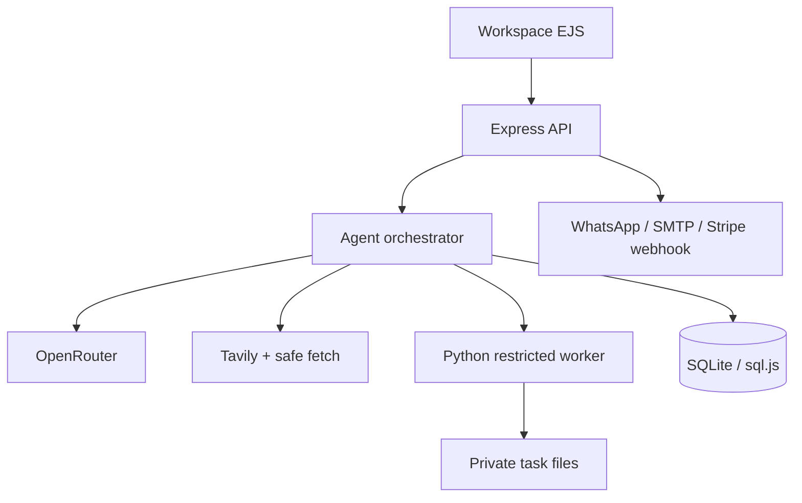

# WES Autonomous Intelligence

WES è un workspace operativo per agenti AI: riceve un obiettivo, crea un piano, usa soltanto strumenti autorizzati, registra ogni passaggio e consegna file verificabili. Include inoltre CRM, WhatsApp, email, agenda, automazioni e pianificazioni ricorrenti.

Non è una semplice chat e non dichiara capacità inesistenti. La versione corrente esegue ricerca web sicura, analisi documentale con Python, lettura CRM, creazione di report Markdown/PDF e flussi commerciali sui connettori realmente configurati.

## Capacità disponibili

- task autonomi con piano, timeline, stop, retry e ripresa dopo riavvio;
- progetti con istruzioni permanenti e memoria dei risultati;
- allegati privati con controllo proprietario, hash SHA-256 e firma del formato;
- analisi Python di CSV, TSV, XLSX, PDF, DOCX, PPTX, TXT, Markdown, JSON e immagini;
- report finali Markdown e PDF reali;
- ricerca Tavily con URL e lettura web protetta da SSRF e DNS rebinding;
- CRM multi-account con lead, conversazioni, score, follow-up e preventivi;
- WhatsApp Cloud API e SMTP verificati prima del salvataggio;
- agenda con rilevamento conflitti e audit degli stati;
- azioni task su email, WhatsApp, agenda e stato lead con approvazione del payload esatto;
- task pianificati per frequenza e fuso orario;
- segreti cifrati AES-256-GCM;
- recupero password con token monouso, scadenza di 30 minuti e revoca delle sessioni precedenti;
- export portabile dei dati account senza password, segreti o percorsi interni;
- pagine commerciali, privacy, cookie e termini configurabili.

## Architettura



Il processo web non esegue codice Python generato dal modello. Il worker espone una lista chiusa di operazioni deterministiche, parte con modalità isolata, limiti CPU/memoria/file e rete disabilitata.

## Requisiti

- Node.js 22+
- Python 3.12+
- dipendenze Python in [requirements.txt](requirements.txt)

## Avvio locale

```bash
cp .env.example .env
npm ci
python3 -m venv .venv
. .venv/bin/activate
pip install -r requirements.txt
npm run build
npm test
npm start
```

Genera segreti diversi per JWT e cifratura, per esempio:

```bash
openssl rand -hex 32
openssl rand -hex 32
```

Il server è disponibile su `http://localhost:3000`. La registrazione crea un account client e il relativo workspace; i dati demo sono disattivati per impostazione predefinita.

Per creare il primo amministratore usa credenziali monouso esplicite (non vengono stampate):

```bash
ADMIN_EMAIL=admin@tuodominio.it \
ADMIN_PASSWORD='una-password-unica-di-almeno-12-caratteri' \
ADMIN_COMPANY='La tua azienda' npm run create-admin
```

`npm run setup-db` inizializza soltanto lo schema. Il seed locale richiede sia `SEED_DEMO_DATA=true` sia una `DEMO_PASSWORD` di almeno 10 caratteri ed è rifiutato in produzione.

## Configurazione

| Variabile | Obbligatoria in produzione | Uso |
|---|---:|---|
| `APP_URL` | sì | URL HTTPS canonico |
| `JWT_SECRET` | sì | firma sessioni, minimo 32 caratteri |
| `APP_ENCRYPTION_KEY` | sì | cifratura segreti, minimo 32 caratteri |
| `DB_PATH` | sì | file SQLite persistente |
| `AGENT_WORKSPACE_ROOT` | sì | directory privata dei task |
| `PYTHON_BIN` | sì | interprete del worker ristretto |
| `ALLOW_PUBLIC_REGISTRATION` | no | in produzione è chiusa per default; abilitala solo quando onboarding e costi sono pronti |
| `OPENROUTER_API_KEY` | no | chiave AI di piattaforma; ogni utente può salvarne una propria |
| `OPENROUTER_MODEL` | no | modello predefinito, default `openrouter/auto` |
| `TAVILY_API_KEY` | no | ricerca web di piattaforma |
| `SMTP_HOST/PORT/USER/PASS` | per email di sistema | reset password e comunicazioni di piattaforma |
| `SMTP_FROM` | no | mittente email di sistema |
| `WHATSAPP_*` + `META_APP_SECRET` | per WhatsApp globale | webhook Meta firmato e invio |
| `STRIPE_SECRET_KEY` + `STRIPE_WEBHOOK_SECRET` | per Stripe | accettazione webhook firmati |
| `LEGAL_NAME/ADDRESS`, `VAT_NUMBER`, `PRIVACY_EMAIL` | sì | dati pubblici del titolare |
| `DATA_RETENTION_DAYS` | no | retention log/richieste, 30–3650 giorni |

Vedi [.env.example](.env.example) per l’elenco completo. In produzione il processo rifiuta l’avvio se mancano configurazioni critiche o se `APP_URL` non usa HTTPS.

Le registrazioni pubbliche sono abilitate di default soltanto in sviluppo. In produzione, senza `ALLOW_PUBLIC_REGISTRATION=true`, le call to action portano alla richiesta di accesso: evita che un’istanza appena pubblicata consumi chiavi AI globali prima che billing e onboarding siano pronti.

## Connettori

### OpenRouter

La chiave può essere impostata nell’ambiente oppure cifrata per singolo account da **Integrazioni**. La chiave personale ha precedenza. Senza chiave AI il task si ferma in `waiting_configuration` invece di simulare un risultato.

### Tavily

Serve per la ricerca autonoma. La lettura di URL pubblici applica controllo protocollo/porta, DNS pubblico, blocco reti private, redirect limitati, timeout e limite di risposta.

### WhatsApp Cloud API

Il pannello verifica token e Phone Number ID tramite Meta prima di salvarli. Il webhook in ingresso accetta solo payload con firma `X-Hub-Signature-256` valida rispetto a `META_APP_SECRET`.

### SMTP

Sono consentite solo le porte 465 e 587. Hostname e certificato TLS vengono verificati e le credenziali devono superare `SMTP verify` prima del salvataggio.

### Stripe

La base corrente gestisce esclusivamente webhook firmati. Checkout, catalogo, imposte e ciclo commerciale vanno configurati nel progetto di vendita; non sono simulati nell’interfaccia.

## Sicurezza

- cookie di autenticazione `HttpOnly`, `SameSite=Lax` e `Secure` in produzione;
- JWT HS256 con account riletto dal database a ogni richiesta;
- origin check sulle mutazioni autenticate;
- rate limit globali, API, chat, autenticazione e moduli pubblici;
- CSP senza CDN e senza `unsafe-eval`;
- segreti applicativi cifrati e mai rimostrati;
- query e download sempre filtrati per proprietario;
- file con limite 10 MB, allowlist MIME/estensione e firma binaria;
- Python senza shell arbitraria, rete disabilitata e limiti di risorse;
- fetch web protetto da SSRF, redirect e DNS rebinding;
- webhook Stripe e Meta verificati crittograficamente;
- log di accessi, decisioni, invii, appuntamenti ed errori;
- pulizia automatica di token scaduti, log e richieste in ingresso.

Per segnalazioni di sicurezza usa una [GitHub private security advisory](https://github.com/walterzannoni90-netizen/piattaformaipersonale/security/advisories/new). Non pubblicare segreti o vulnerabilità sfruttabili in una issue.

## Test e build

```bash
npm run build      # compila Tailwind locale e valida la sintassi JS
npm test           # worker Python, file, SSRF, cifratura, DB e viste
npm audit --omit=dev
```

La CI esegue gli stessi controlli, installa le dipendenze Python e costruisce anche l’immagine Docker.

## Docker

```bash
docker build -t wes-autonomous .
docker run --rm -p 3000:10000 --env-file .env \
  -v wes-data:/var/data wes-autonomous
```

L’immagine usa Node 22, un virtualenv Python, `tini` e un utente non root. Database e workspace devono vivere su un volume persistente.

## Render

[render.yaml](render.yaml) definisce un servizio Docker con disco persistente montato su `/var/data`. Compila tutti i campi `sync: false` prima del deploy.

Questa architettura usa un singolo file SQLite e deve essere eseguita con una sola istanza applicativa. Per replica orizzontale, zero-downtime multiistanza o volumi elevati è necessario migrare il database a PostgreSQL e lo storage a oggetti.

## API principali

| Metodo | Endpoint | Funzione |
|---|---|---|
| `GET` | `/api/health` | salute del processo e database |
| `POST` | `/api/tasks` | crea un task con massimo 5 allegati |
| `GET` | `/api/tasks/:id/state` | stato, eventi, output e approvazioni |
| `POST` | `/api/tasks/:id/stop` | interrompe il task |
| `POST` | `/api/tasks/:id/retry` | riprende un task fermo/configurabile |
| `POST` | `/api/projects` | crea un progetto con memoria |
| `POST` | `/api/schedules` | pianifica task ricorrenti |
| `POST` | `/api/appointments` | crea un appuntamento con controllo conflitti |
| `POST` | `/api/conversations/:id/messages` | risposta manuale WhatsApp |
| `POST` | `/api/integrations/email` | verifica e collega SMTP |
| `POST` | `/api/integrations/whatsapp` | verifica e collega Meta |

Le API del workspace richiedono autenticazione e applicano isolamento per utente.

## Limiti dichiarati

- nessun browser cloud generalista o controllo remoto di schede browser;
- nessun terminale o codice arbitrario generato dal modello;
- nessun registry MCP generico nella versione corrente;
- Calendar OAuth richiede un’implementazione dedicata sul dominio definitivo;
- SQLite e file locali consentono una sola istanza;
- la qualità AI dipende dal modello, dai dati e dalle fonti;
- le pagine legali sono una base configurabile e richiedono validazione professionale sul titolare e sui trattamenti reali.

Questi limiti sono intenzionali: una capacità non disponibile viene indicata come tale invece di essere rappresentata graficamente come attiva.

## Checklist prima della vendita

Leggi [docs/LAUNCH_CHECKLIST.md](docs/LAUNCH_CHECKLIST.md) e completa tutti i gate relativi a identità legale, contratti con fornitori, backup, dominio, email, webhook, osservabilità e prova di ripristino.

## Licenza

MIT. Verifica separatamente le licenze e le condizioni dei servizi terzi collegati.
